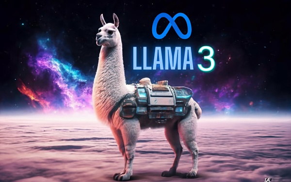
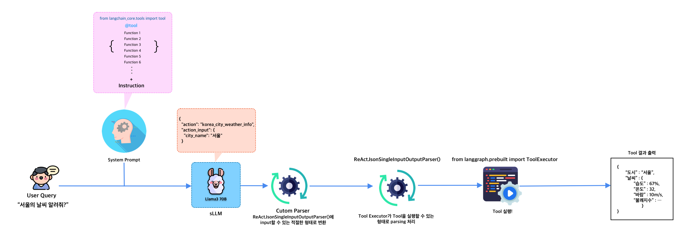

# llama3_langchain_FunctionCall
### Llama3 70B model을 이용한 Langchain Function call 구현 PoC
<p align="center">
  
</p>

## Description
아래 내용은 Llama-cpp를 이용해서 Llama3와 Langchain을 결합하여 Function Call을 구현한 내용입니다.<br>
Llama-cpp를 이용해서 Langchain을 결합한 이유는 아래와 같습니다.
- 직접 Llama3를 올려 서버를 구성(ex.FastAPI)하여 Langchain과 결합할 경우, Langchain에 완벽하게 들어맞는 Parser를 구현하는데 어려움이 있음
- Llama3는 openAI의 API에 비해 Langchain의 Agent동작에 최적화 되어있지 않음.
- Llama-cpp는 Langchain과 호환이 가능한 형태로 개발되었으며, Langchain Agent 관련 클래스들을 동일하게 적용 가능함.

> [ TIP ]<br> 
> 진행과정에서의 다양한 시행착오는 아래 블로그에 정리해두었습니다. 참고해주세요.<br>
> Blog : https://familia-89.tistory.com/94


## Architecture



## Getting Started
NVIDIA GPU 가속을 활용하는 Llama-cpp-python을 사용하기 위해서는, <br>Python과 CUDA 버전을 아래와 같이 맞춰야합니다.
- Python==3.10.14 # 사용가능한 Python version : 3.10, 3.11, or 3.12
- CUDA==12.5 # 사용가능한 CUDA version : 12.1, 12.2, 12.3 or 12.4
- langchain==0.2.1 
- langchain-core==0.2.1
- llama_cpp_python==0.2.76

```bash
 # NVIDIA GPU를 활용하려면 아래 매크로를 통해 llama3-cpp-python을 설치한다.
 !CMAKE_ARGS="-DLLAMA_CUDA=on" pip install llama-cpp-python
 # llama-cpp-python을 구동할때는 반드시 GGUF형식으로 저장된 모델을 사용해야한다.
 !huggingface-cli download Bllossom/llama-3-Korean-Bllossom-70B-gguf-Q4_K_M --local-dir='YOUR-LOCAL-FOLDER-PATH'
```

## Reference
#### [model]
https://huggingface.co/Bllossom/llama-3-Korean-Bllossom-70B-gguf-Q4_K_M

#### [llama-cpp]
1) Langchain - Llama.cpp : https://python.langchain.com/v0.1/docs/integrations/llms/llamacpp/#gpu
2) python binding llama-cpp github(official) : https://github.com/abetlen/llama-cpp-python
3) llama-ccp tutorial : https://kubito.dev/posts/llama-cpp-linux-nvidia/

#### [Langchain & Function Call]

1) Youtube 테디노트 : https://www.youtube.com/@teddynote